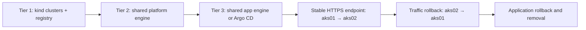

# Three-tier deployment, traffic switch and removal

This worked example creates two disposable Kubernetes clusters, installs the maintained platform, deploys immutable application releases, switches a stable HTTPS endpoint between clusters, rolls traffic back, and removes the test infrastructure. The direct and Argo CD methods use the same application and Gateway API configuration.

For Azure Terraform, real managed identities, Key Vault, private networking and Application Gateway WAF, use the [Azure deployment procedure](https://github.com/MikeeeGit/terraform-delivery-templates/blob/main/docs/azure/three-tier-worked-example.md) and [Azure removal procedure](https://github.com/MikeeeGit/terraform-delivery-templates/blob/main/docs/azure/three-tier-removal.md). An Azure qualification run is separate from this local test.

## What runs



| Tier | Execution | Evidence |
| --- | --- | --- |
| Infrastructure | Two uniquely named kind clusters and a loopback local image registry | Cluster names, tool/image pins and registry readiness |
| Platform | The real shared platform prepare/apply engine, using a committed copy of the maintained Envoy profile | Receipt hashes, template revision, CRDs, safe-upgrade policies, controller and Gateway |
| Application, direct | The real shared renderer and deployment engine, using the scoped synthetic application user | Immutable digest, source revision, actual API permissions, rollout and HTTPS |
| Application, Argo | Shared rendered GitOps proposal followed by real Argo reconciliation | Git revision, sync operation, health, runtime revision, rejection/recovery and drift checks |
| Traffic | One loopback TCP listener forwards to the selected cluster's real Envoy TLS endpoint | Same endpoint, verified TLS hostname, returned cluster and revision before/after switching |
| Removal | Close forwards/listener, delete only the run's kind clusters/registry/image tags | Empty cleanup error list; failed cleanup makes the run fail |

Kind is the infrastructure adapter for this test. It does **not** run Azure Terraform or emulate Entra, Key Vault CSI, private DNS, Application Gateway, WAF or Azure network-policy behavior. Synthetic Kubernetes impersonation tests the declared platform/application permissions; it does not qualify Azure login. Temporary local certificates replace the Azure certificate source.

## Run the complete example

Use Linux or WSL with a running Linux Docker engine, Python 3.11 or later with `venv`, Git, OpenSSL and the Node version range in [.node-version](../.node-version). Internet access is needed to fetch checksum-verified tools, pinned charts/images and Python packages. Run from a committed, clean app checkout; the harness deliberately tests committed source.

```bash
git clone https://github.com/MikeeeGit/aks-platform-demo.git
cd aks-platform-demo

# Both methods, sequentially. Choose a new evidence directory for each run.
python3 scripts/run_worked_example.py \
  --method both \
  --output .delivery/worked-example-01
```

Use `--method direct` or `--method argocd` for one method. The launcher checks Docker and Node, fetches the exact shared-template commit from [worked-example.json](../worked-example.json), creates temporary Python/tool directories, and runs the test. It requires no Azure login, cloud secrets or changes to your existing Kubernetes contexts.

The same launcher is exercised by [GitHub Actions](../.github/workflows/ci.yml) and [Azure Pipelines](../azure-pipelines.yml). In GitHub Actions, run **Application CI** manually to run both methods and retain the evidence artifacts. Required jobs stay present for documentation-only changes; a manual run performs the full validation.

## Follow the deployment and switch

1. **Create infrastructure.** The runner names its two clusters `aks-demo-<run-id>-aks01` and `aks-demo-<run-id>-aks02`. Their registry mirror is configured only inside those disposable nodes.
2. **Install the platform.** An owned kind administrator establishes the generated, opt-in platform binding. The shared platform engine then operates as that synthetic platform user, installing the pinned CRDs, controller and Gateway configuration.
3. **Deploy release 1 to both clusters.** The direct route uses the generated namespace-scoped application Role. The Argo route lets its scoped controller reconcile the application. Both must pass actual runtime and HTTPS checks.
4. **Establish the stable endpoint.** The endpoint initially serves aks01/release 1. TLS still terminates in the selected cluster's Envoy proxy and is checked against the expected hostname.
5. **Deploy release 2 to aks02.** A second source commit produces a distinct immutable image. The stable endpoint must continue serving aks01/release 1.
6. **Switch traffic to aks02.** Change only the relay's selected backend. Requests to the same endpoint must now return aks02/release 2.
7. **Roll traffic back to aks01.** The same endpoint must again return aks01/release 1. The inactive cluster still has release 2 at this point: this proves traffic rollback independently of application rollback.
8. **Restore the inactive application.** Direct delivery reapplies the original approved receipt; Argo restores the original materialized files through a new Git commit. Argo also tests invalid configuration rejection and drift recovery.
9. **Remove the test.** The runner closes its local transports and deletes its owned clusters, registry container and image tags, including on handled failure or interruption.

A switched TCP listener affects new connections. Existing connections retain their original backend until they end; the adapter's socket tests check that behavior. This is not evidence of Azure WAF connection draining, DNS cache expiry or stateful application recovery.

## Read the result

```text
.delivery/worked-example-01/
  worked-example.json          # overall launcher result and exact source pins
  direct/report.json           # all three tiers, permissions, HTTPS, cutover, cleanup
  direct/diagnostics/
  argocd/report.json            # platform + Argo reconciliation and cutover
  argocd/diagnostics/
```

Success requires `result: passed`, all three tier results, all four stable-endpoint observations and no cleanup errors. A failed or incomplete run must not be described as a completed deployment.

The direct report includes the application permission checks and separate platform permission checks: granted operations, forbidden operations, cross-cluster isolation, subject removal and restoration. `tier_execution` records the actual shared implementation revision, script hashes and whether that checkout was modified.

Reports retain non-secret runtime metadata. Kubeconfigs, private certificate keys and their temporary files are removed rather than uploaded as evidence. Base image/tool caches may remain on your machine; the runner does not prune unrelated Docker resources.

## Removal after an abrupt host failure

Normal runs remove their resources automatically. If the machine or Docker engine stops before cleanup, identify the exact run prefix in its logs/diagnostic directory and inspect those resources first:

```bash
kind get clusters
docker ps -a --filter name=aks-demo-
docker images --filter reference='127.0.0.1:*/aks-platform-demo:*'
```

Delete only the two cluster names, registry container and image tags belonging to that recorded run. Do not use a global Docker prune or a wildcard deletion against other clusters. Restarting the original run with a new evidence directory creates fresh names; it does not adopt or clean up unrelated leftovers.

For Azure, use the separate removal procedure. Controllers must be allowed to release cloud resources while the cluster, network and identities still exist; deleting local kind containers does not test that Azure dependency order.

## Before claiming the Azure example passed

Retain actual Terraform plan/apply and CI federation results, both platform runs, both application CSI qualification reports, WAF HTTPS cutover/rollback checks, and removal verification from the selected Azure environment. This kind example establishes the shared Kubernetes execution and connection-routing behavior only.
